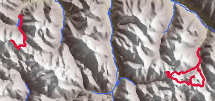

# Hiking Map Plots

This repository contains code to plot hikes (GPX traces) onto maps.

## Prepare required data

### Height map data

I am using the GMTED2010 data, which is kindly [provided by USGS](https://topotools.cr.usgs.gov/gmted_viewer/index.html).
This dataset contains elevation data every 7.5 arc-seconds. That is a resolution of around 200m (depending on where you are on the globe).

The next steps contain information on how to download this for the larger part of Europe, adjust to your needs:

```bash
cd topo-land
wget https://edcintl.cr.usgs.gov/downloads/sciweb1/shared/topo/downloads/GMTED/Global_tiles_GMTED/075darcsec/mea/E000/30N000E_20101117_gmted_mea075.tif
wget https://edcintl.cr.usgs.gov/downloads/sciweb1/shared/topo/downloads/GMTED/Global_tiles_GMTED/075darcsec/mea/E000/50N000E_20101117_gmted_mea075.tif
wget https://edcintl.cr.usgs.gov/downloads/sciweb1/shared/topo/downloads/GMTED/Global_tiles_GMTED/075darcsec/mea/W030/30N030W_20101117_gmted_mea075.tif
wget https://edcintl.cr.usgs.gov/downloads/sciweb1/shared/topo/downloads/GMTED/Global_tiles_GMTED/075darcsec/mea/W030/50N030W_20101117_gmted_mea075.tif
cd ..
# merge into a single file
python -m hikingplots.tools.merge_tif topo-land/30N000E_20101117_gmted_mea075.tif topo-land/50N000E_20101117_gmted_mea075.tif topo-land/30N030W_20101117_gmted_mea075.tif topo-land/50N030W_20101117_gmted_mea075.tif topo-land/merged.tif
```

### Hydrological data

I am using the EU-Hydro – River Network Database, Version 1.3, which is kindly [provided by European Environment Agency (EEA)](https://www.eea.europa.eu/data-and-maps/data/external/eu-hydro-2013-river-network.0-1).
Download the full dataset and extract it.
The following scripts should help with that.

The next steps assume that you have downloaded the file `EU_hydro_gpkg_eu.zip` into the `topo-water` folder.
Then run

```bash
unzip topo-water/EU_hydro_gpkg_eu.zip -d topo-water/EU_hydro_gpkg_eu
find topo-water/EU_hydro_gpkg_eu -name "euhydro_*_v013_GPKG.zip" | xargs -n1 unzip -d topo-water/EU_hydro_gpkg_eu
rm topo-water/EU_hydro_gpkg_eu/euhydro_*_v013_GPKG.zip
```

### Hiking tracks

The folder `example-tracks` contains examples of how the folder structure should look like.
What matters is that there is a separate subfolder per track that contains a `*.gpx` file (the exact file name does not matter).

## Plot several tracks onto a single map

This is meant to plot several tracks over a larger area, as the resolution of the height map dataset is too limited for plotting individual tracks.

The following script plots all example tracks, which are distributed over a larger part of the alps.
```bash
python -m hikingplots.plot.main plot-area \
    --tracks-path example-tracks \
    --track-plot-solid \
    --track-plot-width-scale 4 \
    --output-path example-plots/alps.png
```

Result:


The following script illustrates how to limit the plots, using the `dolomiti` tag as an example.
```bash
python -m hikingplots.plot.main plot-area \
    --tracks-path example-tracks \
    --tag dolomiti \
    --track-plot-solid \
    --track-plot-width-scale 2 \
    --output-path example-plots/only-dolomiti.png
```

Notice that the smaller the resulting area, the blurrier the image looks because of the limited resolution of the GMTED2010 dataset:



The script offers several options to tune the appearance. Use the following script to display them:
```bash
python -m hikingplots.plot.main plot-area --help
```

## Plot a single track in black and white

This library also contains code to plot a single track in black and white.
This is intended to be used with the hiking quiz, here is an illustration just to show what this is about.

```bash
python -m hikingplots.plot.main plot-track-duotone \
    example-tracks/widderstein \
    --draw-topo \
    --draw-major-level-labels \
    --track-halign center \
    --output-path example-plots/widderstein-duotone.png
```

Result:


If this looks pixelated to you, then you are correct.
The reason is that this is rendered for an 800x480 e-Paper display that only supports black and white (no grayscale).

## Notes

The scripts support other activities like cycling tours.
Set
```yaml
type: cycling
```
in `metadata.yaml`.
